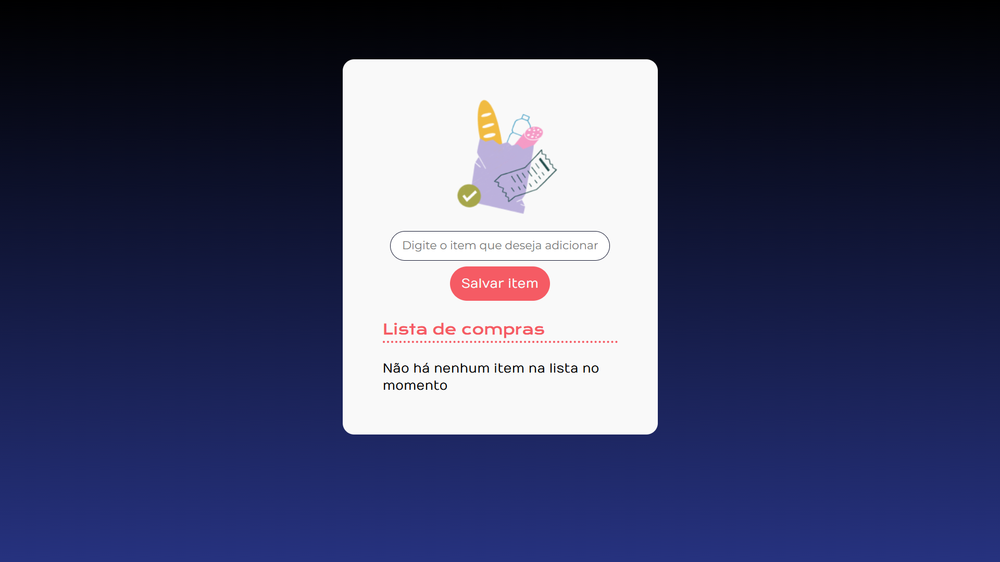
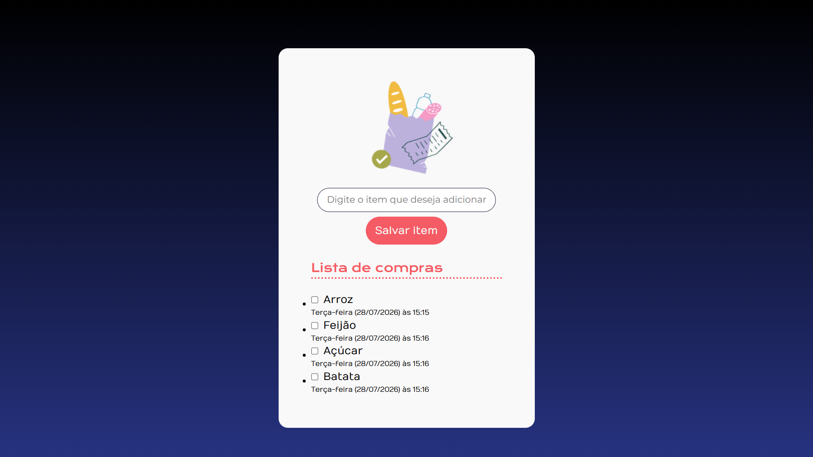
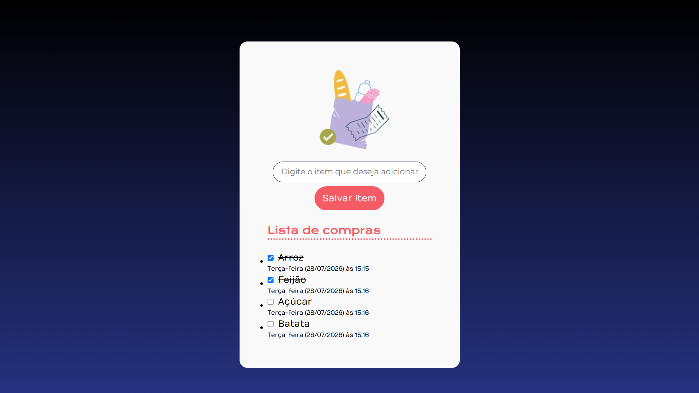

# 🛒 Lista de Compras


<p align="center">
  
</p>

<p align="center">
  
  
</p>

---

## 📌 Links

* **Repositório:** https://github.com/Leonardo-Daniel-SC/lista-de-compras
* **Projeto Online:** https://leonardo-daniel-sc.github.io/lista-de-compras

---

## 📖 Sobre o projeto

Essa **Lista de Compras** é uma página web desenvolvida com HTML, CSS e JavaScript que permite adicionar, visualizar e gerenciar itens de uma lista de compras de forma simples e intuitiva.

Cada item cadastrado registra automaticamente a **data e o horário em que foi adicionado**, proporcionando um histórico simples das compras.

O projeto foi desenvolvido focando em praticar conceitos fundamentais de JavaScript, como manipulação do DOM, criação dinâmica de elementos, eventos, módulos ES6 e manipulação de datas utilizando a API `Date`.

---

## ✨ Funcionalidades

* ➕ Adicionar novos itens à lista.
* 📝 Exibição dinâmica dos itens cadastrados.
* 🕒 Registro automático da data e hora em que cada item foi adicionado.
* ☑️ Marcar itens como concluídos.
* 📋 Mensagem automática quando a lista estiver vazia.
* 📱 Interface responsiva e de fácil utilização.

---

## 🛠️ Tecnologias utilizadas

* HTML5
* CSS3
* JavaScript (ES6 Modules)

---

## 📂 Estrutura do projeto

```text
📁 lista-de-compras
│
├── img/
│   ├── bag.png
│   ├── lista-compras-1.png
│   ├── lista-compras-2.png
│   └── lista-compras-3.png
│
├── index.html
├── styles.css
├── app.js
└── README.md
```

---

## ▶️ Como executar o projeto

1. Clone este repositório:

```bash
git clone https://github.com/seu-usuario/nome-do-repositorio.git
```

2. Acesse a pasta do projeto:

```bash
cd nome-do-repositorio
```

3. Abra o arquivo **index.html** em seu navegador.

Ou utilize a extensão **Live Server** do Visual Studio Code.

---

## 💡 Como utilizar

1. Digite o nome do item no campo de texto.
2. Clique em **Salvar item**.
3. O item será adicionado automaticamente à lista.
4. Marque o item quando ele for concluído.

---

## 📚 Conceitos praticados

Durante o desenvolvimento foram aplicados conceitos importantes, como:

* Manipulação do DOM
* Eventos de clique
* Criação dinâmica de elementos HTML
* Organização do código em módulos JavaScript
* Manipulação de datas e horários com a API `Date`
* Estruturas condicionais
* Arrays
* Funções reutilizáveis
* Boas práticas de organização de código

---

## 🚀 Melhorias futuras

* 💾 Persistência dos dados utilizando Local Storage.
* ✏️ Editar itens existentes.
* 🔍 Campo de pesquisa.
* 📂 Organização por categorias.
* ⭐ Itens favoritos.
* 🌙 Tema escuro.
* 📊 Contador de itens concluídos e pendentes.

---
